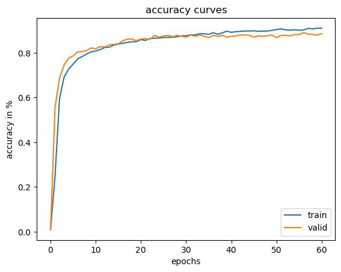
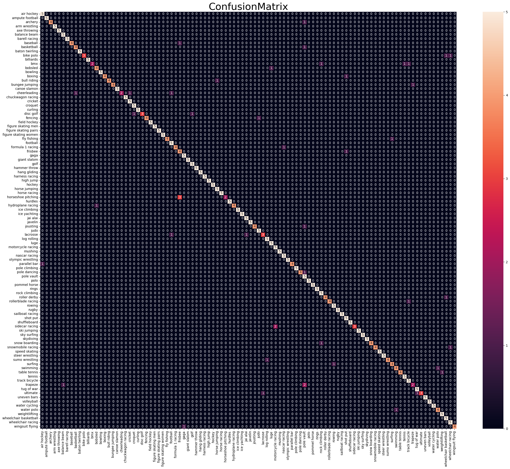

# Image Classification with EfficientNet

This project aims to preform 100 class sports image classification using transfer learning from pretrained EfficientNet. This project includes: image data processing, training deep learning models for classification, GradCAM for visualization, and a GUI for your own data.


### Dataset: 
[Kaggle sports classification](https://www.kaggle.com/datasets/gpiosenka/sports-classification/)


### Pretrained Model Weights:
[Pretrained EfficientNetB0](https://download.pytorch.org/models/efficientnet_b0_rwightman-7f5810bc.pth)


### Build: 

	CPU: Intel Core Ultra 9 185H (16 cores)
	GPU: NVIDIA RTX 4090 (VRAM 16 GB)
	RAM: 32 GB
	Screen: 2560 x 1600 (150% Scale)


### Python Packages:

	conda install pytorch==2.5.1 torchvision==0.20.1 torchaudio==2.5.1 pytorch-cuda=12.4 -c pytorch -c nvidia
	conda install -c conda-forge pandas = 2.2.2
	conda install -c conda-forge tqdm = 4.66.5
	conda install -c conda-forge matplotlib = 3.9.2
	conda install -c conda-forge numpy = 1.26.4
	conda install -c conda-forge opencv = 4.10.0


### Training Curves

<p align="center">
  
  
</p>


### Test Dataset Preformance



### Code Structure:
```bash
├── GUI.py (Run to generate a GUI)
├── main.py (Run to train model)
├── efficientnet.py
├── qt_main.py
├── training.py
├── summary.py
├── visualization.py

```

### Credits:
	"EfficientNet: Rethinking Model Scaling for Convolutional Neural Networks"

	