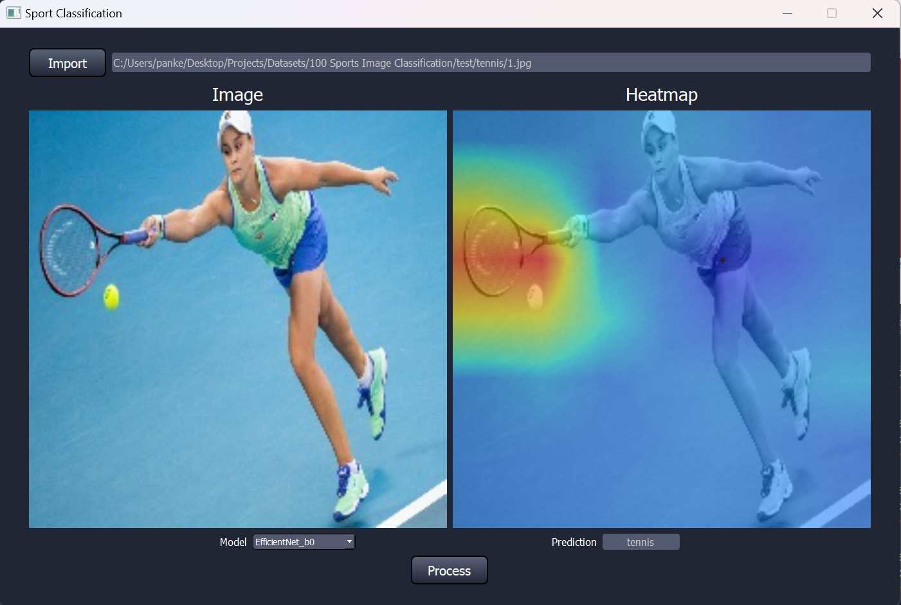

# Image Classification with EfficientNet

This project aims to preform 100 class sports image classification using transfer learning from pretrained EfficientNet. This project includes: image data processing, training deep learning models for classification, GradCAM for visualization, and a GUI for your own data.



### Dataset: 
[Kaggle sports classification](https://www.kaggle.com/datasets/gpiosenka/sports-classification/)


### Build: 

	CPU: Intel i9-13900H (14 cores)
	GPU: NVIDIA RTX 4060 (VRAM 8 GB)
	RAM: 32 GB


### Python Packages:

	conda install pytorch==2.1.2 torchvision==0.16.2 torchaudio==2.1.2 pytorch-cuda=12.1 -c pytorch -c nvidia
	conda install -c conda-forge pandas = 1.5.3
	conda install -c conda-forge tqdm = 4.64.1
	conda install -c conda-forge matplotlib = 3.8.0
	conda install -c conda-forge numpy = 1.26.4
	conda install -c conda-forge opencv = 4.9.0


### Training Curves

<p align="center">
  
  
</p>


### Code Structure:
```bash
├── GUI.py (Run to generate a GUI)
├── main.py (Run to train model)
├── efficientnet.py
├── qt_main.py
├── training.py
├── summary.py
├── visualization.py

```

### Credits:
	"EfficientNet: Rethinking Model Scaling for Convolutional Neural Networks"

	